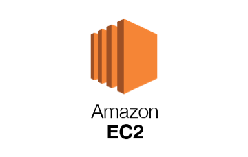

  <h2 align="center">color POOL 🐳</h2>
  
Get recommendations color combination and related contents on <a href="#"> color POOL!</a>

   
  

## Features
- [Get recommendation](#get-recommendation)
- [Create your own magazine](#create-your-own-magazine)
- [Subscribe to the newsletter](#subscribe-to-the-newsletter)
- [Docs](#docs)
- [Issues](#issues)
- [Version](#version)
- [See also](#see-also)

## Get Recommendation
사용자 중심 컬러 추천 받기

            

## Create Your Own Magazine
나만의 잡지 만들기

            

## Subscribe To The Newsletter
정기적으로 뉴스레터 서비스 제공받기

            

## Docs

- [git branch 전략](./docs/convention/git%20branch%20전략.md)
- [git commit message convention](./docs/convention/commit%20message%20convention.md)
- [coding convention](./docs/convention/coding%20convention.md)
- [기획](./docs/%EA%B8%B0%ED%9A%8D)
  - [Ideation](./docs/%EA%B8%B0%ED%9A%8D/1-Ideation.md)
  - [Research](./docs/%EA%B8%B0%ED%9A%8D/2-Research.md)
  - [Development](./docs/%EA%B8%B0%ED%9A%8D/3-Development.md)
  - [Feedback](./docs/%EA%B8%B0%ED%9A%8D/4-Feedback.md)

     

## Issues

### Backend
- [TDD를 어떻게 시작해볼까 👀](./docs/이슈/TDD를%20어떻게%20시작해볼까%20👀.md)
- [Jpa 사용시 객체지향 설계에 대한 고찰 🤔](./docs/이슈/Jpa%20사용시%20객체지향설계에%20대한%20고찰%20🤔.md)
- [중복 회원 검증에 대한 이슈 🙄](./docs/이슈/Unique%20constraint%20예외처리%20고도화%20in%20Spring%20boot%20🙄.md)
- [리소스 권한 이슈 - Jwt & SpringSecurity 사용기 🔐](./docs/이슈/리소스%20권한%20이슈%20-%20Jwt%20&%20SpringSecurity%20사용기%20🔐.md)
### Infra
- [Nginx - 정적 콘텐츠와 API의 공존]()

### Data
- [코사인 유사도 측정 시 부동소수점 예외처리 이슈](./docs/이슈/코사인_유사도_측정_시_부동소수점_예외처리_이슈.md)
- [코사인 유사도 개수 예측 오류 이슈](./docs/이슈/코사인_유사도_개수_예측_오류_이슈.md)

     

## Version
- [Release 1.0.1]()

     

## See Also

### Contributor

| 이름                                                  | 역할             | 내용                                                         |
| ----------------------------------------------------- | ---------------- | ------------------------------------------------------------ |
| [강세응](https://github.com/seeungKang) [이등병]      | FE | 메인 화면/이미지 제공 화면 구현, api 이용한 색상 정보 불러오기, 반응형 기본 틀 구현 |
| [김윤진](https://github.com/YNNJN) [Front Carry]     | FE, 데이터, 기획 | 와이어프레임 제작, 기술리서치(FE & 데이터), 데이터 전처리(python) |
| [김준호](https://github.com/junhok82) [프로 일꾼]     | BE, 인프라 | 회원관련(BE), Exception 고도화, Jwt & SpringSecurity, 인프라 구축 |
| [배현석](https://github.com/beaverbae2) [풀스택 팀장] | 데이터 | 관련기술 및 논문 학습, 데이터 전처리(matlab), 코사인 유사도 계산 |
| [윤재원](https://github.com/jane399) [개발천재]       | FE | 회원가입/로그인, 소셜로그인, 배색 추천 화면, 컬러 및 배색 데이터 관리 로직 구현 |

 

### 기술 스택

 

 

 
   
