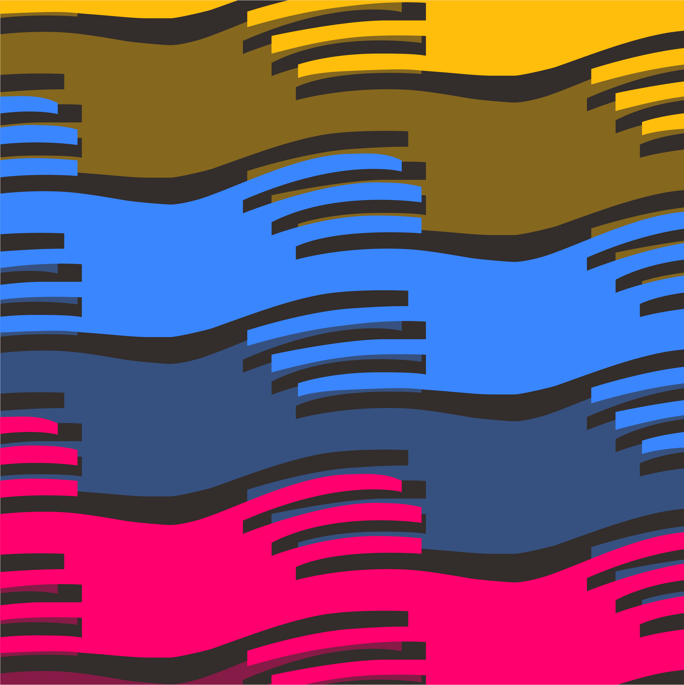
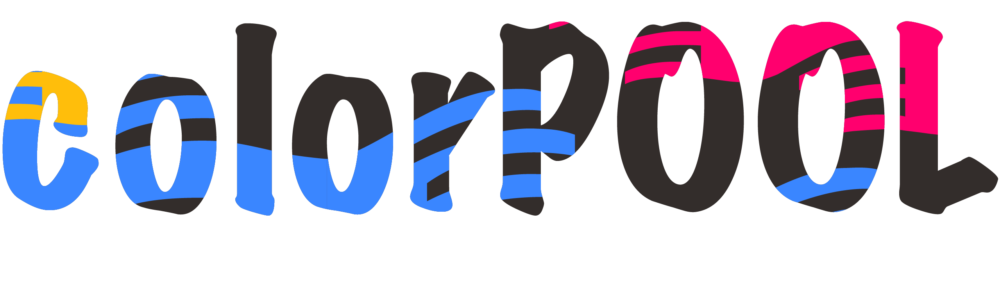
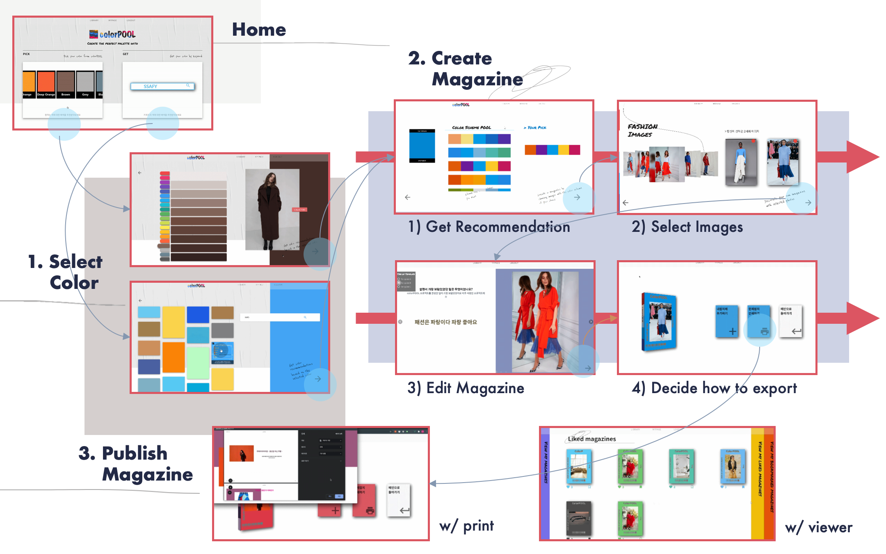
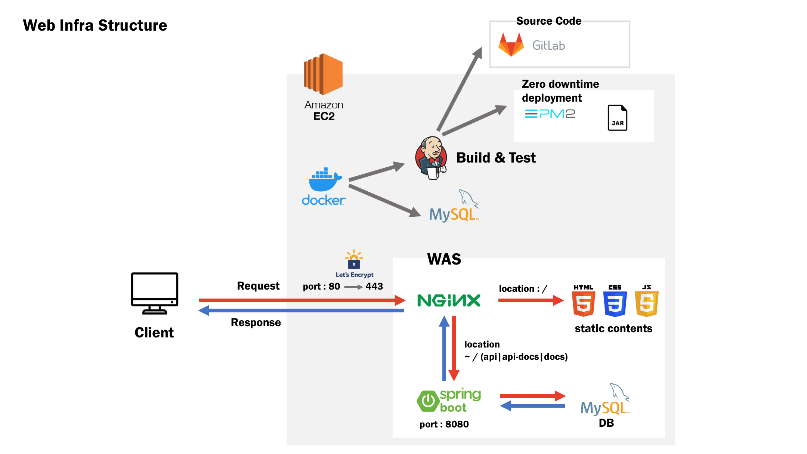
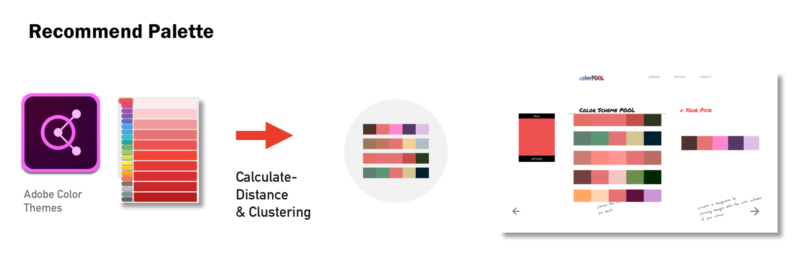
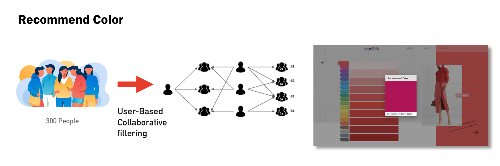

  

     
  

Tell your stories with your palette using the knowledge of millions of designers

   
  

 

 

## Index

### Introduction

- [What is colorPOOL?](#what-is-colorPOOL?)
- [Why colorPOOL?](#why-colorPOOL?)

### Features

- [Get recommendation](#get-recommendation)
- [Create your own magazine](#create-your-own-magazine)

### Infra

- [Web Infra Structure](#web-infra-structure)
- [Big Data](#big-data)

### Documents

- [Docs](#docs)
- [Issues](#issues)

 

 

## What Is ColorPOOL?

>  [colorPOOL](https://j3a303.p.ssafy.io/)의 빅데이터 풀에서 나의 own 컬러와 배색을 찾고, 나만의 컨텐츠를 만들어보세요

1. colorPOOL은 캐주얼한 컨텐츠로 소비될 수 있는 서비스를 지향합니다

2. 멋진 배색을 찾고, 컬러 플레이를 즐기고, 나만의 컨텐츠를 만들고 싶은 사용자를 대상으로 합니다

3. 온라인에서 다시 오프라인으로 이어지는 유저 경험을 제공합니다

   - 메인컬러를 선택하여 배색을 추천받고, 배색을 포함하는 이미지로 매거진을 제작할 수 있습니다
   - 편집한 매거진은 인쇄를 통해 실물로 만나볼 수 있습니다

 

 

## Why ColorPOOL?

> **colorPOOL**은 배색 추천 정보를 제공하는 유사 서비스들과 두 가지 차별점을 지닙니다

1. 전문 디자이너가 아닌, 일반 대중을 대상으로 합니다

2. 추천한 컬러와 배색에 대한 단순 정보 제공이 아닌, 매거진이라는 컨텐츠로 만나볼 수 있습니다

 

 

## Get Recommendation
> 컬러를 선택하고, 해당 컬러에 대한 배색을 추천받으세요
>
> **Pick Color**와 **Get Color**, 두 가지 방법으로 컬러를 선택할 수 있습니다

 

### Pick Color

> colorPOOL의 200가지 컬러를 직접 선택해보세요

- 20개의 대표 컬러군 중 하나를 선택하면, 해당 컬러군에 속하는 10개 컬러를 밝기 별로 살펴볼 수 있습니다

- 컬러의 선택할 때마다 나타나는 대표 이미지를 통해 컬러의 느낌을 확인하세요

- 컬러 선택 기록이 있는 유저는 `Color Hint` 버튼을 통해 컬러를 추천받을 수 있습니다
- 컬러 선택을 완료하여, 배색 10가지를 추천받으세요 

 

### Get Color

> 키워드를 입력하여, 키워드를 대표하는 컬러를 선택해보세요

- 구글 이미지 검색 결과에 대해 대표색을 보여주는 방식입니다
- 검색의 결과는 colorPOOL의 대표 컬러와 가장 가까운 컬러로 보여집니다

  

## Create Your Own Magazine
> 내가 만들 잡지 컨텐츠의 카테고리를 선택하고,
>
> 내가 선택한 배색에 대한 이미지를 선택하여, 나만의 잡지를 만들어보세요

 

### Select Images

> 선택한 배색을 포함한 이미지를 확인하세요
>
> colorPOOL이 제공한 이미지 중 마음에 드는 것을 선택하여, 잡지의 재료로 활용해보세요

 

### Publish Magazine

> 잡지의 레이아웃을 선택하고 제공된 인터뷰 질문에 대한 답변을 적어, 나만의 잡지를 만들어보세요

 

- 웹 뷰어를 통해 내가 만든 잡지의 내용을 확인하세요
- 또한 인쇄하기 기능을 통해 실물로 간직해보세요

 

 

- 라이브러리에서 colorPOOL의 인기 매거진을 만나보세요
- 마이페이지에서 내가 만든, 좋아요한, 북마크한 잡지를 확인하세요

 

  

## Web Infra Structure

  

## Big Data

### Collect Data

- **colorPOOL**은 Adobe Color에서 제공하는 백 만 명의 디자이너가 평점을 매긴 배색 데이터를 수집했습니다
- 45000개의 데이터 중 상위 3000개의 데이터를 추출하여 분석에 활용했습니다
  - 추출한 3000개의 데이터는 평균 평점이 최고 5점 중 4.35, 표준편차가 0.26인 신뢰할 수 있는 데이터입니다

 

### Set Reference Colors

> `표본 색채를 선정`하기 위해 데이터를 **Quantization** 하고 **Clustering** 했습니다

- 비슷한 색들을 근사하고, 인간이 인식하는 색차와 균등하게 보정하여 군집화했습니다
- 결과로 표본 색채 200개를 선정했습니다
- 화면에서는 200개의 컬러를 20개의 군으로 카테고리화 하여 `컬러 피커`의 형태로 보여줍니다

 

### Recommend Palette

> `배색을 추천`하기 위해 데이터를 **Clustering** 했습니다

- 배색을 이루는 5개의 컬러 중 표본 색채와의 색차 거리를 계산하여, 표본 색채를 기준으로 군집화했습니다
- 이 중 평점이 상위 10위 안에 드는 배색 조합을 서비스에서 추천하고 있습니다

 

### Recommend Color

> **`컬러 추천`**에 **User-Based Collaborative Filtering** 방식을 활용했습니다

- 300명의 유저 데이터를 이용해 유저 기반의 협업 필터링을 진행했습니다
- 유사도 측정에는 피어슨 상관계수를 이용하여, 코사인 유사도의 경우 벡터의 크기가 커질 때 신뢰도가 떨어지는 문제를 보완했습니다
- 화면에서는 `Color Hint 버튼`을 클릭하여 colorPOOL이 추천하는 메인 컬러를 확인하고 선택 여부를 결정할 수 있습니다

  

## Docs

- [git branch 전략](./docs/convention/git%20branch%20전략.md)
- [git commit message convention](./docs/convention/commit%20message%20convention.md)
- [coding convention](./docs/convention/coding%20convention.md)
- [기획](./docs/%EA%B8%B0%ED%9A%8D)
  - [Ideation](./docs/%EA%B8%B0%ED%9A%8D/1-Ideation.md)
  - [Research](./docs/%EA%B8%B0%ED%9A%8D/2-Research.md)
  - [Development](./docs/%EA%B8%B0%ED%9A%8D/3-Development.md)
  - [Feedback](./docs/%EA%B8%B0%ED%9A%8D/4-Feedback.md)
- [와이어프레임](./docs/와이어프레임/wireFrame&flow_ver.1.jpeg)

  

## Issues

### Frontend

- [Vuex 모듈화](./docs/이슈/Vuex_모듈화_.md)
- [동적 이미지에 대한 export와 pdf](./docs/이슈/동적 이미지에 대한 export와 PDF.md)
- [axios에서 보낸 post 요청이 백엔드에서 차단하는 이슈]('./docs/이슈/axios에서 보낸 post 요청이 백엔드에서 차단하는 이슈.md')

### Backend

- [TDD를 어떻게 시작해볼까 👀](./docs/이슈/TDD를%20어떻게%20시작해볼까%20👀.md)
- [Jpa 사용시 객체지향 설계에 대한 고찰 🤔](./docs/이슈/Jpa%20사용시%20객체지향설계에%20대한%20고찰%20🤔.md)
- [중복 회원 검증에 대한 이슈 🙄](./docs/이슈/Unique%20constraint%20예외처리%20고도화%20in%20Spring%20boot%20🙄.md)
- [리소스 권한 이슈 - Jwt & SpringSecurity 사용기 🔐](./docs/이슈/리소스%20권한%20이슈%20-%20Jwt%20&%20SpringSecurity%20사용기%20🔐.md)

### Data

- [데이터 전처리 중 양자화 간격 이슈 🔮](./docs/이슈/데이터%20전처리%20중%20양자화%20간격%20이슈%20🔮.md)

- [코사인 유사도 측정 시 부동소수점 예외처리 이슈](./docs/이슈/코사인_유사도_측정_시_부동소수점_예외처리_이슈.md)
- [코사인 유사도 개수 예측 오류 이슈](./docs/이슈/코사인_유사도_개수_예측_오류_이슈.md)

  

## See Also

### Timeline

> 개발 기간: 9/8/2020 ~ 10/14/2020

 

### Contributor

| 이름                                                  | 역할             | 내용                                                         |
| ----------------------------------------------------- | ---------------- | ------------------------------------------------------------ |
| [강세응](https://github.com/seeungKang) [이등병]      | FE | 컬러 선택, 잡지 제작, 잡지 추출 화면 및 기능 구현 |
| [김윤진](https://github.com/YNNJN) [Front Carry]     | FE, 데이터, 기획 | 표본색채 선정(양자화), 배색 추천 기능 구현(군집화), 화면 UI 개선 |
| [김준호](https://github.com/junhok82) [프로 일꾼]     | BE, 인프라 | Exception 고도화, Jwt & SpringSecurity, 인프라 구축 |
| [배현석](https://github.com/beaverbae2) [풀스택 팀장] | 데이터 | 표본색채 선정(군집화), 컬러 추천 기능 구현(협업필터링) |
| [윤재원](https://github.com/jane399) [개발천재]       | FE | 회원 관리, 배색 추천, 잡지 목록 화면 및 기능 구현 |

 

### Awards

- 🥈삼성청년SW아카데미 특화 프로젝트(도메인: 빅데이터) 2등상 수상

 

### Technologies used

 

 

 
 