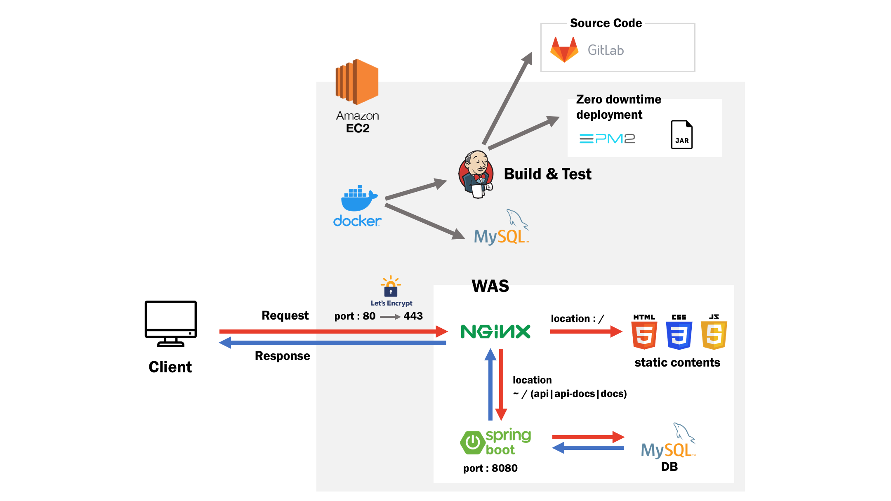
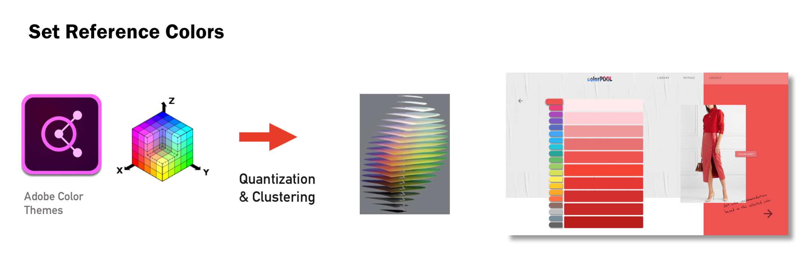

  <h2 align="center">colorPOOL 🐳</h2>
  
Tell your stories with your palette using the knowledge of millions of designers

   
  

 

 

## Index

### Introduction

- [What is colorPOOL](#what-is-colorPOOL)
- [Why colorPOOL](#why-colorPOOL)

### Features

- [Get recommendation](#get-recommendation)
- [Create your own magazine](#create-your-own-magazine)
- [Subscribe to the newsletter](#subscribe-to-the-newsletter)

### Infra

- [Web Infra Structure](#web-infra-structure)
- [Big Data](#big-data)

### Documents

- [Docs](#docs)
- [Issues](#issues)

 

 

## What Is ColorPOOL?

>  **[colorPOOL](https://j3a303.p.ssafy.io/)**의 빅데이터 풀에서 나의 own 컬러와 배색을 찾고, 나만의 컨텐츠를 만들어보세요

1. 컬러풀은 캐주얼한 컨텐츠로 소비될 수 있는 서비스를 지향합니다

2. 멋진 배색을 찾고, 컬러 플레이를 즐기고, 나만의 컨텐츠를 만들고 싶은 사용자를 대상으로 합니다

3. 온라인에서 다시 오프라인으로 이어지는 유저 경험을 제공합니다

   - 메인컬러를 선택하여 배색을 추천받고, 배색을 포함하는 이미지로 매거진을 제작할 수 있습니다
   - 편집한 매거진은 인쇄를 통해 실물로 만나볼 수 있습니다

 

## Why ColorPOOL?

> **colorPOOL**은 배색 추천 정보를 제공하는 유사 서비스들과 두 가지 차별점을 지닙니다

1. 전문 디자이너가 아닌 일반 대중을 대상으로 합니다

2. 추천한 컬러와 배색에 대한 단순 정보 제공이 아닌, 컨텐츠로서 정보를 제공합니다
   - 컨텐츠는 유저가 직접 커스텀할 수 있습니다

 

 

## Get Recommendation
사용자 중심 컬러 추천 받기

            

## Create Your Own Magazine
나만의 잡지 만들기

            

## Subscribe To The Newsletter
정기적으로 뉴스레터 서비스 제공받기

            

## Web Infra Structure

  

## Big Data

> **colorPOOL**은 Adobe Color에서 제공하는 백 만 명의 디자이너가 평점을 매긴 배색 데이터를 수집했습니다
>
> 수집한 데이터 중 데이터의 평균 평점과 표준 편차가 적당한 수준(평균 평점 : 4.35, 표준편차 : 0.26)이라고 판단한
>
> 상위 3000개의 데이터를 추출하여 분석에 활용했습니다

 

### Set Reference Colors

> **`표본 색채를 선정`**하기 위해 데이터를 **Quantization** 하고 **Clustering** 했습니다

- 비슷한 색들을 근사하고, 인간이 인식하는 색차와 균등하게 보정하여 군집화했습니다
- 결과로 표본 색채 200개를 선정했습니다
- 화면에서는 200개의 컬러를 20개의 군으로 카테고리화 하여 컬러 피커의 형태로 보여줍니다

 

### Recommend Palette

> **`배색을 추천`**하기 위해 데이터를 **Clustering** 했습니다

- 배색을 이루는 5개의 컬러 중 표본 색채와의 색차 거리를 계산하여, 표본 색채를 기준으로 군집화했습니다
- 이 중 평점이 상위 10위 안에 드는 배색 조합을 서비스에서 추천하고 있습니다

 

### Recommend Color

> **`컬러 추천`**에 **User-Based Collaborative Filtering** 방식을 활용했습니다

- 300명의 유저 데이터를 통해 유저 기반의 협업 필터링을 진행했습니다
- 유사도 측정에는 피어슨 상관계수를 이용하여, 코사인 유사도의 경우 벡터의 크기가 커질 때 신뢰도가 떨어지는 문제를 보완했습니다
- 화면에서는 Color Hint 버튼을 클릭하여 colorPOOL이 추천하는 메인 컬러를 확인하고 선택 여부를 결정할 수 있습니다

  

## Docs

- [git branch 전략](./docs/convention/git%20branch%20전략.md)
- [git commit message convention](./docs/convention/commit%20message%20convention.md)
- [coding convention](./docs/convention/coding%20convention.md)
- [기획](./docs/%EA%B8%B0%ED%9A%8D)
  - [Ideation](./docs/%EA%B8%B0%ED%9A%8D/1-Ideation.md)
  - [Research](./docs/%EA%B8%B0%ED%9A%8D/2-Research.md)
  - [Development](./docs/%EA%B8%B0%ED%9A%8D/3-Development.md)
  - [Feedback](./docs/%EA%B8%B0%ED%9A%8D/4-Feedback.md)
- [와이어프레임](./docs/와이어프레임/wireFrame&flow_ver.1.jpeg)

     

## Issues

### Frontend

- [Vuex 모듈화](./docs/이슈/Vuex_모듈화_.md)

### Backend

- [TDD를 어떻게 시작해볼까 👀](./docs/이슈/TDD를%20어떻게%20시작해볼까%20👀.md)
- [Jpa 사용시 객체지향 설계에 대한 고찰 🤔](./docs/이슈/Jpa%20사용시%20객체지향설계에%20대한%20고찰%20🤔.md)
- [중복 회원 검증에 대한 이슈 🙄](./docs/이슈/Unique%20constraint%20예외처리%20고도화%20in%20Spring%20boot%20🙄.md)
- [리소스 권한 이슈 - Jwt & SpringSecurity 사용기 🔐](./docs/이슈/리소스%20권한%20이슈%20-%20Jwt%20&%20SpringSecurity%20사용기%20🔐.md)

### Data

- [데이터 전처리 중 양자화 간격 이슈 🔮](./docs/이슈/데이터%20전처리%20중%20양자화%20간격%20이슈%20🔮.md)

- [코사인 유사도 측정 시 부동소수점 예외처리 이슈](./docs/이슈/코사인_유사도_측정_시_부동소수점_예외처리_이슈.md)
- [코사인 유사도 개수 예측 오류 이슈](./docs/이슈/코사인_유사도_개수_예측_오류_이슈.md)

     

## See Also

### Contributor

| 이름                                                  | 역할             | 내용                                                         |
| ----------------------------------------------------- | ---------------- | ------------------------------------------------------------ |
| [강세응](https://github.com/seeungKang) [이등병]      | FE | 메인 화면/이미지 제공 화면 구현, api 이용한 색상 정보 불러오기, 반응형 기본 틀 구현 |
| [김윤진](https://github.com/YNNJN) [Front Carry]     | FE, 데이터, 기획 | 와이어프레임 제작, 기술리서치(FE & 데이터), 데이터 전처리(python) |
| [김준호](https://github.com/junhok82) [프로 일꾼]     | BE, 인프라 | 회원관련(BE), Exception 고도화, Jwt & SpringSecurity, 인프라 구축 |
| [배현석](https://github.com/beaverbae2) [풀스택 팀장] | 데이터 | 관련기술 및 논문 학습, 데이터 전처리(matlab), 코사인 유사도 계산 |
| [윤재원](https://github.com/jane399) [개발천재]       | FE | 회원가입/로그인, 소셜로그인, 배색 추천 화면, 컬러 및 배색 데이터 관리 로직 구현 |

 

### 기술 스택

 

 

 
   
