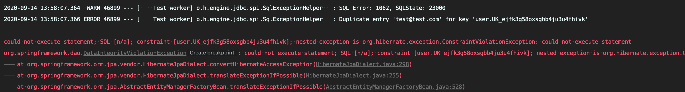

## Spring JPA unique constraint 예외처리
Spring JPA를 사용중에 Entity에서 Column(unique = true) 제약조건에 대한 핸들링 방법

### 사건의 발단 🤷
유저 아이디는 유일하기때문에 UserService에서 `validateDuplicated`의 회원 **중복 검증 과정**을 거친다. 그럼에도 불구하고 동시에 같은 아이디로(회원가입 유저에 대해 commit 되기 전) 회원가입을 한다면 유저 아이디가 중복으로 가입될 수 있는데, 이를 방지하기 위해서 아이디에 unique 제약조건을 걸었다.

그런데 중복 회원가입 검증 테스트코드 작성중 미리 만들어 놓은 `CUserDuplicatedException`에러가 아닌 `DataIntegrityViolationException` 에러가 발생했다. 이는 같은 영속성 내에 같은 유저 아이디가 등록되게 된다면, unique 제약조건에 따른 에러였다.



이 때, `DataIntegrityViolationException`은 스프링 프레임워크에서 다루는 Exception이므로 최총적으로 아래와 같은 에러를 발생시킨다.

``` java
package org.springframework.dao;

/**
 * Exception thrown when an attempt to insert or update data
 * results in violation of an integrity constraint. Note that this
 * is not purely a relational concept; unique primary keys are
 * required by most database types.
 *
 * @author Rod Johnson
 */
@SuppressWarnings("serial")
public class DataIntegrityViolationException extends NonTransientDataAccessException {

	/**
	 * Constructor for DataIntegrityViolationException.
	 * @param msg the detail message
	 */
	public DataIntegrityViolationException(String msg) {
		super(msg);
	}

	/**
	 * Constructor for DataIntegrityViolationException.
	 * @param msg the detail message
	 * @param cause the root cause from the data access API in use
	 */
	public DataIntegrityViolationException(String msg, Throwable cause) {
		super(msg, cause);
	}

}
```

그런데 **Hibernate**에서 제약조건 오류로 발생시키는 Exception을 확인해보니, `ConstraintViolationException`에서의 제약 조건의 이름을 위의 `DataIntegrityViolationException`에서 유실시킨다는 점을 확인 할 수 있었다.

``` java
/*
 * Hibernate, Relational Persistence for Idiomatic Java
 *
 * License: GNU Lesser General Public License (LGPL), version 2.1 or later.
 * See the lgpl.txt file in the root directory or <http://www.gnu.org/licenses/lgpl-2.1.html>.
 */
package org.hibernate.exception;
import java.sql.SQLException;

import org.hibernate.JDBCException;

/**
 * Implementation of JDBCException indicating that the requested DML operation
 * resulted in a violation of a defined integrity constraint.
 *
 * @author Steve Ebersole
 */
public class ConstraintViolationException extends JDBCException {

	private String constraintName;

	public ConstraintViolationException(String message, SQLException root, String constraintName) {
		super( message, root );
		this.constraintName = constraintName;
	}

	public ConstraintViolationException(String message, SQLException root, String sql, String constraintName) {
		super( message, root, sql );
		this.constraintName = constraintName;
	}

	/**
	 * Returns the name of the violated constraint, if known.
	 *
	 * @return The name of the violated constraint, or null if not known.
	 */
	public String getConstraintName() {
		return constraintName;
	}
}
```

<br>

### 어떻게 해결할까 ❓

우리 프로젝트에서는 컨트롤러의 @ExceptionHandler를 통해 예외처리를 하고 있었으므로 이를 채택했다.

``` java
	@ExceptionHandler(DataIntegrityViolationException.class)
	@ResponseStatus(HttpStatus.CONFLICT) // 409
	protected CommonResult userEmailConstraintException(HttpServletRequest request, DataIntegrityViolationException e) {
		return responseService.getFailResult(Integer.parseInt(getMessage("userEmailConstraint.code")), getMessage("userEmailConstraint.msg"));
	} 
```

i18n 메세징 처리를 통해서 예외처리를 진행했고, 아래와 같은 테스트가 통과하는 것을 확인했다.

``` java
	@Test
	public void 동시_같은_아이디_가입() throws Exception {
		// given
		User user1 = User.builder()
			.email("test@test.com")
			.password(passwordEncoder.encode("1234!"))
			.provider("root")
			.roles(Collections.singletonList("GUEST"))
			.build();

		User user2 = User.builder()
			.email("test@test.com")
			.password(passwordEncoder.encode("1234!"))
			.provider("root")
			.roles(Collections.singletonList("GUEST"))
			.build();

		// when
		userJpaRepository.save(user1);

		// then
		assertThrows(DataIntegrityViolationException.class, () -> {
			userJpaRepository.save(user2);
		});
	}
```